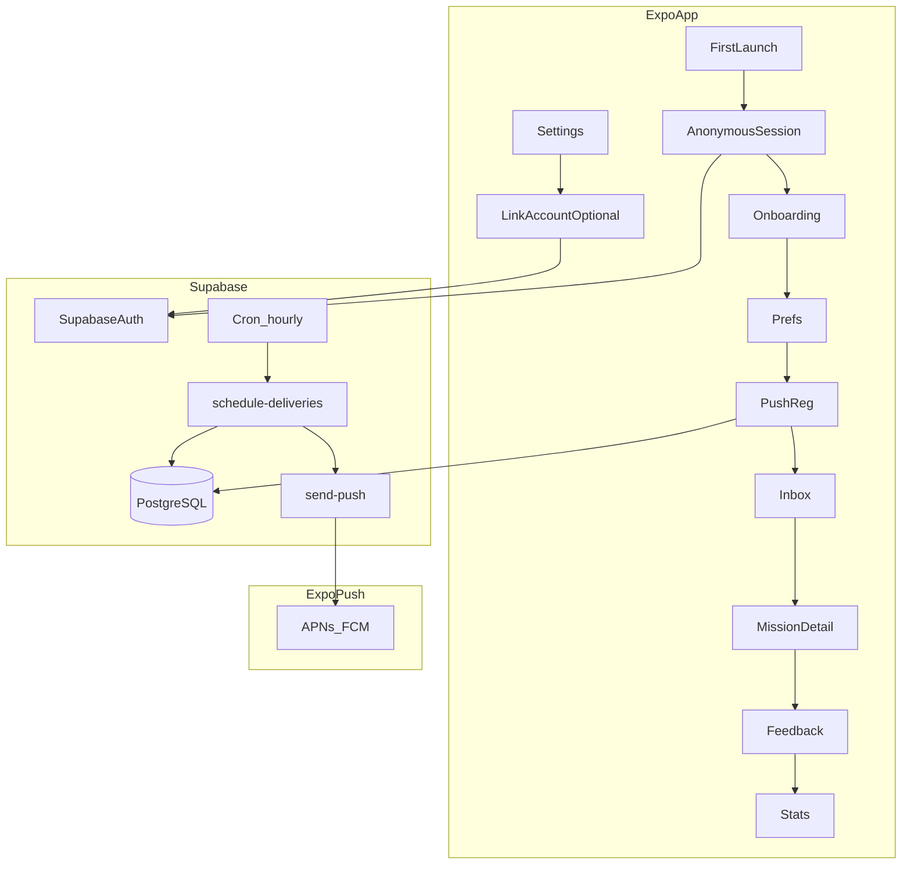

# PRD Technique — IRL MVP (Cursor-ready)

**Source de vérité produit:** [MASTER.md](./MASTER.md)  
**Audience:** développeurs + agents Cursor qui implémentent le MVP sans relire tout le MASTER.  
**Locales MVP:** contenu utilisateur-facing en **anglais** (`locale = en`).

---

## 1. Scope MVP — In scope / Non-goals

### In scope

- **Session anonyme automatique** à la première ouverture (Supabase Anonymous Auth — invisible pour l’utilisateur)
- **Liaison de compte optionnelle** Apple Sign-In / Google Sign-In (Settings) pour sync multi-appareil
- Onboarding (**<60s**) : catégories, plages horaires actives, consentement notifications (+ analytics opt-in) — **sans écran login**
- Bibliothèque de missions (**seed JSON** → table `missions`)
- **Scheduler server-side** : livraisons aléatoires, espacement minimum, cap hebdomadaire
- **Push** via Expo Push API depuis une Edge Function
- Écrans : **Inbox**, **Mission**, **Complété + feedback**, **Stats**, **Paramètres**
- Actions mission : **Accept / Later / Skip** ; après complétion auto-déclarée : **helpful 👍👎**
- GDPR minimal : **export JSON** données utilisateur + **suppression compte**
- Deep link depuis la notification vers l’écran mission

### Non-goals (ne pas implémenter en MVP — réf. MASTER §9, §17)

- Détection de scroll / screen time / app au premier plan
- Missions générées par IA
- Abonnements / paiements / paywall
- Social, partage de cartes virales
- Streaks, badges lourds, classements
- « Another mission » (interface possible en stub ; logique reportée Phase 2)
- **Login obligatoire** au premier lancement (Apple/Google Welcome screen)
- Produits tiers analytics (Mixpanel, etc.)

---

## 2. Architecture cible



**Décision auth:** pas de login au lancement. À la première ouverture, créer une **session anonyme Supabase** (`signInAnonymously`) persistée en SecureStore. Apple/Google ne sont proposés que dans **Settings → Save progress** pour restaurer prefs/stats sur un nouvel appareil.

**Décision notifications:** les notifications sont **servies par le backend** (Edge + Expo Push), pas uniquement scheduling local, pour garantir :

- Surprise possible **sans ouverture récente** de l’app
- Logs `delivered` / `opened` / actions pour Phase 2
- Alignement MASTER : pas de surveillance du scroll pour déclencher

---

## 3. Arborescence repo cible

```
IRL/
├── app/                       # Expo Router
│   ├── index.tsx              # bootstrap session + redirect onboarding/main
│   ├── (onboarding)/hours.tsx
│   ├── (onboarding)/consent.tsx
│   ├── (main)/_layout.tsx
│   ├── (main)/inbox.tsx
│   ├── (main)/stats.tsx
│   ├── (main)/settings.tsx    # incl. Link account (Apple/Google)
│   └── mission/[id].tsx       # deep link + query deliveryId
├── src/
│   ├── components/
│   ├── lib/supabase.ts
│   ├── lib/auth.ts            # signInAnonymously, linkIdentity, session restore
│   ├── lib/notifications.ts
│   ├── hooks/
│   ├── types/
│   └── constants/
├── supabase/
│   ├── migrations/            # fichier SQL Phase B
│   └── functions/
│       ├── schedule-deliveries/
│       ├── send-push/
│       ├── user-data-export/
│       └── delete-account/
├── docs/
│   ├── MASTER.md
│   ├── PRD.md
│   └── missions.seed.json
├── .env.example
└── package.json
```

**Dépendances clés (package.json MVP):**

- `expo`, `react-native`
- `expo-router`
- `expo-notifications`
- `expo-apple-authentication` *(liaison compte optionnelle — iOS)*
- `@react-native-google-signin/google-signin` *(liaison compte optionnelle)*
- `@supabase/supabase-js`
- `@react-native-async-storage/async-storage` + `expo-secure-store` (session SecureStore où applicable)
- `zod`

---

## 4. Modèle de données PostgreSQL — migration MVP

Une seule migration initiale conseillée : `supabase/migrations/00000001_init.sql`.

### 4.1 Enums et tables

```sql
-- Extensions (si besoin d'uuid)
create extension if not exists "uuid-ossp";

-- Categories alignées MASTER (libellés stockés en minuscules)
create type mission_category as enum (
  'social','nature','curiosity','adventure','creativity','calm','learning'
);

create type frequency_tier as enum ('low','medium');

create type delivery_status as enum (
  'scheduled','delivered','opened','accepted','postponed','skipped','completed'
);

create type response_action as enum ('accepted','postponed','skipped');

-- Extension profil utilisateur
create table public.profiles (
  id uuid primary key references auth.users (id) on delete cascade,
  timezone text not null default 'UTC',          -- ex: Europe/Paris
  onboarding_completed boolean not null default false,
  account_linked_at timestamptz,                 -- null = session anonyme ; set après linkIdentity Apple/Google
  created_at timestamptz not null default now(),
  updated_at timestamptz not null default now()
);

-- Préférences onboarding
create table public.user_preferences (
  user_id uuid primary key references public.profiles (id) on delete cascade,
  categories mission_category[] not null check (array_length(categories, 1) >= 2),
  active_hour_start smallint not null check (active_hour_start between 0 and 23),
  active_hour_end smallint not null check (active_hour_end between 0 and 23),
  frequency frequency_tier not null default 'low',
  notifications_enabled boolean not null default true,
  analytics_consent boolean not null default false,
  updated_at timestamptz not null default now()
);

-- Tokens push Expo (un user peut avoir plusieurs appareils)
create table public.push_tokens (
  id uuid primary key default gen_random_uuid(),
  user_id uuid not null references public.profiles (id) on delete cascade,
  expo_push_token text not null,
  platform text not null check (platform in ('ios','android')),
  last_seen_at timestamptz not null default now(),
  unique (user_id, expo_push_token)
);

-- Bibliothèque missions (globale, lecture tous utilisateurs auth)
create table public.missions (
  id uuid primary key default gen_random_uuid(),
  category mission_category not null,
  teaser text not null,
  title text not null,
  body text not null,
  locale text not null default 'en',
  is_active boolean not null default true,
  created_at timestamptz not null default now()
);

-- Une ligne = une notification planifiée / livrée pour un user
create table public.mission_deliveries (
  id uuid primary key default gen_random_uuid(),
  user_id uuid not null references public.profiles (id) on delete cascade,
  mission_id uuid not null references public.missions (id) on delete restrict,
  scheduled_at timestamptz not null,
  delivered_at timestamptz,
  opened_at timestamptz,
  status delivery_status not null default 'scheduled',
  created_at timestamptz not null default now(),
  updated_at timestamptz not null default now()
);

create index idx_deliveries_user_scheduled on public.mission_deliveries (user_id, scheduled_at desc);
create index idx_deliveries_user_status on public.mission_deliveries (user_id, status);

-- Réponse utilisateur au delivery (accept / postpone / skip) + feedback helpful
create table public.mission_responses (
  delivery_id uuid primary key references public.mission_deliveries (id) on delete cascade,
  user_id uuid not null references public.profiles (id) on delete cascade,
  action response_action not null,
  helpful boolean, -- null jusqu'à étape feedback après "completed"
  responded_at timestamptz not null default now(),
  completed_at timestamptz -- quand status delivery passe à completed côté app
);

-- Évènements analytics (opt-in analytics_consent)
create table public.analytics_events (
  id uuid primary key default gen_random_uuid(),
  user_id uuid references public.profiles (id) on delete cascade,
  event text not null,
  payload jsonb not null default '{}',
  created_at timestamptz not null default now()
);

create index idx_analytics_user_created on public.analytics_events (user_id, created_at desc);

-- Trigger updated_at léger pour profiles et deliveries (optionnel, squelette)
create or replace function public.set_updated_at()
returns trigger as $$
begin
  new.updated_at = now();
  return new;
end;
$$ language plpgsql;

create trigger profiles_updated_at
before update on public.profiles for each row execute function public.set_updated_at();

create trigger deliveries_updated_at
before update on public.mission_deliveries for each row execute function public.set_updated_at();
```

### 4.2 RLS (Row Level Security)

```sql
alter table public.profiles enable row level security;
alter table public.user_preferences enable row level security;
alter table public.push_tokens enable row level security;
alter table public.missions enable row level security;
alter table public.mission_deliveries enable row level security;
alter table public.mission_responses enable row level security;
alter table public.analytics_events enable row level security;

-- profiles: utilisateur voit/modifie sa ligne
create policy profiles_self_select on public.profiles
  for select using (auth.uid() = id);
create policy profiles_self_update on public.profiles
  for update using (auth.uid() = id);

-- user_preferences
create policy prefs_self_all on public.user_preferences
  for all using (auth.uid() = user_id) with check (auth.uid() = user_id);

-- push_tokens
create policy tokens_self_all on public.push_tokens
  for all using (auth.uid() = user_id) with check (auth.uid() = user_id);

-- missions: lecture pour tout utilisateur authentifié (pas d'écriture client)
create policy missions_read on public.missions
  for select to authenticated using (is_active = true);

-- mission_deliveries
create policy deliveries_self_all on public.mission_deliveries
  for all using (auth.uid() = user_id) with check (auth.uid() = user_id);

-- mission_responses
create policy responses_self_all on public.mission_responses
  for all using (auth.uid() = user_id) with check (auth.uid() = user_id);

-- analytics_events: insert/select own (MVP)
create policy analytics_self_insert on public.analytics_events
  for insert with check (auth.uid() = user_id);
create policy analytics_self_select on public.analytics_events
  for select using (auth.uid() = user_id);
```

**Note:** les Edge Functions utilisent `service_role` pour insérer/mettre à jour des `mission_deliveries` et envoyer des push — **bypass RLS**. Ne jamais exposer la clé service au client.

### 4.3 Trigger création `profiles` à l’inscription

S’applique à **toute** création `auth.users` — session anonyme **ou** compte lié :

```sql
create or replace function public.handle_new_user()
returns trigger as $$
begin
  insert into public.profiles (id, timezone, onboarding_completed, account_linked_at)
  values (
    new.id,
    'UTC',
    false,
    case when coalesce(new.is_anonymous, false) then null else now() end
  );
  return new;
end;
$$ language plpgsql security definer set search_path = public;

create trigger on_auth_user_created
after insert on auth.users
for each row execute function public.handle_new_user();
```

**Note:** activer **Anonymous Sign-Ins** dans Supabase Dashboard → Authentication → Providers.

### 4.4 Seed missions

Importer [missions.seed.json](./missions.seed.json) via script SQL généré ou seed manuel en Phase B. Le PRD impose **≥10 missions** actives en `en`.

---

## 5. Règles du scheduler (MVP)

**Constantes (configurer par variables d’environnement Edge ou table `app_config` plus tard) :**

| Constante | Valeur MVP |
|-----------|------------|
| `MIN_GAP_HOURS` | 36 |
| `LOW_WEEKLY_CAP` | 2 livraisons / fenêtre glissante 7 jours |
| `MEDIUM_WEEKLY_CAP` | 4 livraisons / fenêtre glissante 7 jours |
| `MISSION_COOLDOWN_DAYS` | 30 (ne pas re-livrer la même mission à ce user s’il l’a reçue dans les 30 derniers jours) |

**Fenêtre active:** `active_hour_start` et `active_hour_end` en **heure locale** du `profiles.timezone` (IANA). Cas chevauchant minuit : si `start > end`, la fenêtre est `[start, 23]` ∪ `[0, end]` (documenter et implémenter explicitement).

**Algorithme `schedule-deliveries` (invocation horaire):**

1. Charger les users avec `profiles.onboarding_completed = true` et `user_preferences.notifications_enabled = true` et au moins un `push_tokens` non vide.
2. Pour chaque user :
   - Compter les `mission_deliveries` dont `delivered_at` (ou `scheduled_at` si on compte les planifiées — **décision:** compter les lignes avec `status` ≥ `delivered` ou `scheduled` dans les 7 derniers jours selon cap hebdo ; **MVP recommandé:** compter `created_at` des deliveries dans les 7 derniers jours pour inclure planifiées).
   - Si count ≥ cap (`low`/`medium`) → skip.
   - Trouver la dernière livraison (max `scheduled_at`). Si `now() - last_scheduled_at < MIN_GAP_HOURS` → skip.
   - Calculer « maintenant » en timezone user.
   - Tirer un **slot aléatoire** dans la fenêtre active **restée aujourd’hui** ; si aucun slot valide aujourd’hui, **planifier demain** à un instant aléatoire dans la fenêtre (ou skip ce run).
   - Sélectionner une mission aléatoire parmi `missions` où `category = any(user_preferences.categories)` et `locale = 'en'` et `is_active` et **exclure** les `mission_id` déjà livrés à ce user dans les `MISSION_COOLDOWN_DAYS` derniers.
   - Insérer `mission_deliveries` avec `scheduled_at = slot`, `status = 'scheduled'`.
   - Si `scheduled_at <= now()` (UTC comparé correctement) → invoquer `send-push` pour ce `delivery_id`.

**Fréquence cron:** **toutes les heures** (simple) ; un run peut ne rien faire pour un user (gaps 48h+ naturels si cap bas + hasard).

---

## 6. Edge Functions

### 6.1 `schedule-deliveries`

- **Auth:** header `Authorization: Bearer <CRON_SECRET>` ou JWT service (ne pas exposer au client).
- **Rôle:** exécuter l’algorithme §5 ; insérer des rows ; appeler `send-push` en interne (HTTP local ou import partagé).

### 6.2 `send-push`

- **Input:** `{ deliveryId: string }` (service role).
- Étapes :
  1. Charger `mission_deliveries` + `missions` + `push_tokens` du user.
  2. Construire payload Expo :
     - `title`: `missions.teaser`
     - `body`: chaîne vide ou sous-titre minimal (ne pas mettre le corps complet)
     - `data`: `{ url: "irl://mission/<missionId>?deliveryId=<deliveryId>" }` (ajuster schéma app `expo-router`)
  3. POST `https://exp.host/--/api/v2/push/send` avec tableau de messages.
  4. Mettre à jour `mission_deliveries`: `delivered_at = now()`, `status = 'delivered'` si pas déjà.

**Secrets:** `SUPABASE_SERVICE_ROLE_KEY`, `CRON_SECRET`, optionnel `EXPO_ACCESS_TOKEN` si requis par la politique Expo du projet.

### 6.3 `user-data-export`

- **Auth:** utilisateur (JWT) **ou** service + user id (MVP : appeler avec JWT utilisateur via `supabase.functions.invoke`).
- Retourner JSON agrégé : `profile`, `preferences`, `push_tokens` (masquer partiellement token si besoin), `deliveries`, `responses`, `analytics_events`.

### 6.4 `delete-account`

- **Auth:** JWT utilisateur.
- Ordre : supprimer données `public.*` en cascade (FK) puis `auth.users` via **Admin API** (`supabase.auth.admin.deleteUser`) avec service role **uniquement côté Edge**.

### 6.5 Planification cron Supabase

Dans le dashboard Supabase → **Edge Functions** → **Schedules** (ou **Database Webhooks** / `pg_cron` + `pg_net`) :

- Appeler `schedule-deliveries` **toutes les heures** avec secret partagé.

Documenter l’URL exacte et le header attendu dans le README du repo après scaffold.

---

## 7. Client mobile — écrans et navigation

| Écran | Route | Comportement |
|-------|-------|--------------|
| Bootstrap | `/` (`index.tsx`) | Si pas de session → `signInAnonymously()` ; redirect onboarding ou inbox |
| Hours | `/(onboarding)/hours` | `active_hour_start` / `active_hour_end` + `frequency` (step 1 of 2) |
| Consent | `/(onboarding)/consent` | Toggle notifications (si refus → `notifications_enabled=false` + pas de push) ; toggle analytics ; copy : pas de spam, gaps 48h+ OK (step 2 of 2) |
| Inbox | `/(main)/inbox` | Liste `mission_deliveries` join `missions` triées par `scheduled_at` desc |
| Mission | `/mission/[id]` | Query `deliveryId` ; affiche title/body ; boutons Accept / Later / Skip |
| Complete | même route ou modal | Après action « Accept », CTA « I did it » → `status=completed` + écran feedback helpful |
| Stats | `/(main)/stats` | Agrégations : total completed, par `category` |
| Settings | `/(main)/settings` | Éditer prefs ; **Save progress** (Apple/Google si non lié) ; export ; delete account |

**Pas d’écran Welcome / login au lancement.**

### 7.1 Machine d’état `mission_deliveries.status`

- `scheduled` → (push) → `delivered`
- Tap notification / ouverture inbox → `opened` + `opened_at`
- Accept → `accepted` + insert `mission_responses(action=accepted)`
- Later → `postponed` + `mission_responses(action=postponed)` (MVP : peut remettre `scheduled` pour re-push plus tard **hors scope** ; traiter comme fin de ce cycle pour la v1)
- Skip → `skipped` + `mission_responses(action=skipped)`
- « I did it » → `completed` + `completed_at` sur response + étape feedback `helpful` bool

### 7.2 Deep linking

Configurer **scheme** Expo (`irl` dans l’exemple) et associer la route `mission/[id]` au `data.url` envoyé par Expo Push.

À l’open : lecture `deliveryId`, update `opened_at`, `status=opened`.

### 7.3 Enregistrement push token

À la fin de onboarding (si notifications autorisées) :

1. Demander permission `Notifications.requestPermissionsAsync()`.
2. `getExpoPushTokenAsync()` + stocker ligne `push_tokens` (upsert par token).

Tester sur **EAS Dev Build** (Expo Go ne couvre pas tous les cas de remote push projet).

---

## 8. Authentification

### Principe MVP : anonyme par défaut, compte optionnel

L’utilisateur **n’a jamais à se connecter** pour utiliser l’app. Un `user_id` stable est créé automatiquement pour push, prefs, deliveries et stats.

### 8.1 Première ouverture (obligatoire)

Au bootstrap (`app/index.tsx` ou `src/lib/auth.ts`) :

1. Restaurer session Supabase depuis SecureStore.
2. Si aucune session → `supabase.auth.signInAnonymously()`.
3. Le trigger `handle_new_user` crée `profiles` (`account_linked_at = null`).
4. Redirect : onboarding si `!onboarding_completed`, sinon inbox.

```typescript
// Squelette — à implémenter en Phase C
const { data, error } = await supabase.auth.signInAnonymously();
// data.session.user.id = user_id stable pour toute la stack backend
```

### 8.2 Liaison de compte optionnelle (Settings)

**Quand proposer :** section Settings « Save progress » — jamais au premier lancement.

**Pourquoi :** restaurer prefs, historique et stats sur un **nouvel appareil** après réinstall ou changement de téléphone.

**Flow :**

1. Utilisateur tape « Save progress with Apple » ou « … Google ».
2. Récupérer `identityToken` / `idToken` du provider.
3. Appeler `supabase.auth.linkIdentity({ provider, token })` **sur la session anonyme courante** (conserve le même `user_id` et toutes les données).
4. Mettre à jour `profiles.account_linked_at = now()`.

**Apple (iOS) :** `expo-apple-authentication` → `linkIdentity({ provider: 'apple', token: identityToken })`.

**Google :** `@react-native-google-signin/google-signin` → `linkIdentity({ provider: 'google', token: idToken })`.

**Exigence App Store :** si Google Sign-In est proposé sur iOS, **Apple Sign-In doit aussi être disponible** (guideline Apple) — OK car les deux sont dans Settings.

### 8.3 Restauration sur nouvel appareil

1. Install app → `signInAnonymously()` (nouveau user_id temporaire).
2. Settings → « Restore progress » → Sign in Apple/Google (compte **déjà lié**).
3. Supabase remplace la session anonyme par la session du compte lié → même `user_id`, données restaurées.

**Implémentation :** utiliser `signInWithIdToken` si l’utilisateur n’a pas de session anonyme locale, ou documenter le flow Supabase recommandé pour « sign in on new device » (session du compte lié récupère le user existant).

### 8.4 Session

- Persistance via `@supabase/supabase-js` + **SecureStore** (AsyncStorage fallback dev seulement).
- JWT anonyme et JWT lié sont tous deux `authenticated` pour RLS — aucun changement de policies requis.

### 8.5 Limites acceptées (MVP)

- **Désinstall sans compte lié** → perte prefs/stats/historique (expliquer dans Settings : « Link an account to keep your progress »).
- OAuth Apple/Google peut être **reporté en fin de Phase H** si le MVP fonctionne d’abord en anonyme pur ; le schéma et `account_linked_at` restent prêts.

### 8.6 Configuration Supabase

- Activer **Anonymous Sign-Ins** (Auth → Providers).
- Configurer Apple / Google OAuth pour `linkIdentity` (Phase H ou quand Settings link est implémenté).
- Variables client : `EXPO_PUBLIC_GOOGLE_WEB_CLIENT_ID` requis **uniquement** quand Google link est activé.

---

## 9. Analytics (MVP)

Si `analytics_consent = true`, le client `insert` dans `analytics_events` :

- `onboarding_completed`
- `mission_opened`, `mission_accepted`, `mission_skipped`, `mission_postponed`, `mission_completed`
- `feedback_helpful_yes`, `feedback_helpful_no`

**North Star (requête indicative, fenêtre 7 jours):**

```sql
select
  count(*) filter (where d.status = 'completed')::float
  / nullif(count(distinct d.user_id), 0) as missions_completed_per_wau
from public.mission_deliveries d
where d.updated_at > now() - interval '7 days';
```

(Affiner selon définition exacte de WAU / cohorte produit.)

---

## 10. Variables d’environnement

### Client — `.env.example`

```
EXPO_PUBLIC_SUPABASE_URL=
EXPO_PUBLIC_SUPABASE_ANON_KEY=
# Requis uniquement quand liaison Google est activée (Settings)
EXPO_PUBLIC_GOOGLE_WEB_CLIENT_ID=
```

### Edge Functions (secrets Supabase)

```
SUPABASE_URL=
SUPABASE_SERVICE_ROLE_KEY=
CRON_SECRET=
EXPO_ACCESS_TOKEN=
```

Ne jamais committer de clés réelles.

---

## 11. Phases d’implémentation (ordre Cursor)

| Phase | Objectif | Vérification |
|-------|----------|--------------|
| **A — Scaffold** | `create-expo-app`, Router, `src/lib/supabase.ts`, `.env.example` | App démarre, env lue |
| **B — DB** | Appliquer migration §4 + seed missions ; activer Anonymous Sign-Ins Supabase | ≥10 missions, RLS OK |
| **C — Session anonyme** | `src/lib/auth.ts` + bootstrap `index.tsx` → `signInAnonymously` | Première ouverture crée `profiles` sans UI login |
| **D — Onboarding** | 3 écrans → `user_preferences` + `profiles.onboarding_completed=true` | Données visibles ; redirect inbox |
| **E — Push token** | Permission + upsert `push_tokens` | Token présent après onboarding |
| **F — Scheduler** | Edge `schedule-deliveries` + `send-push` + cron | Device physique reçoit push dans fenêtre locale |
| **G — UX mission** | Inbox → détail → actions → feedback | Boucle bout-en-bout sur iOS/Android dev build |
| **H — Stats, GDPR & link compte** | Stats ; export/delete ; Settings **Save progress** Apple/Google + restore | Stats OK ; link conserve `user_id` ; restore sur 2e device |

---

## 12. Stratégie de tests

- **Unitaires (TS)** : fonctions pures helpers pour fenêtre locale, exclusion missions récentes, cap hebdomadaire — extraire hors Edge pour tester avec `vitest`/`jest`.
- **Intégration** : politiques RLS (scripts ou tests Supabase locaux si utilisés).
- **Manuel obligatoire** : push réel via EAS build sur au moins **un iPhone + un Android**.
- **Beta** : ≥20 users, suivre North Star + rétention J7/J30.

---

## 13. Risques et mitigations

| Risque | Mitigation |
|--------|------------|
| Push non reçu en dev | EAS Dev Build ; vérifier certificats APNs / FCM |
| Apple rejette pour « health » wording | Copie App Store hors scope médical (MASTER §10) |
| Timezone incorrecte | Demander mise à jour `profiles.timezone` via `Intl` ou `expo-localization` + sync |
| Utilisateur plaint « pas de notif depuis 48h » | Copie onboarding MASTER : intentional sparse |
| RLS empêche une Edge Function oubliée | Toujours `service_role` côté server pour inserts système |
| Perte de données après désinstall (anonyme) | Copy Settings « Link account to save progress » ; link avant changement device |
| `linkIdentity` échoue (compte déjà utilisé) | UI erreur claire ; doc Supabase merge rules ; hors scope merge MVP |

---

## 14. Références croisées

- Vision / ton / non-surveillance scroll : [MASTER.md](./MASTER.md)
- Payload missions seed : [missions.seed.json](./missions.seed.json)

---

**Document PRD MVP — version 1.1** *(auth anonyme par défaut ; liaison Apple/Google optionnelle)*
